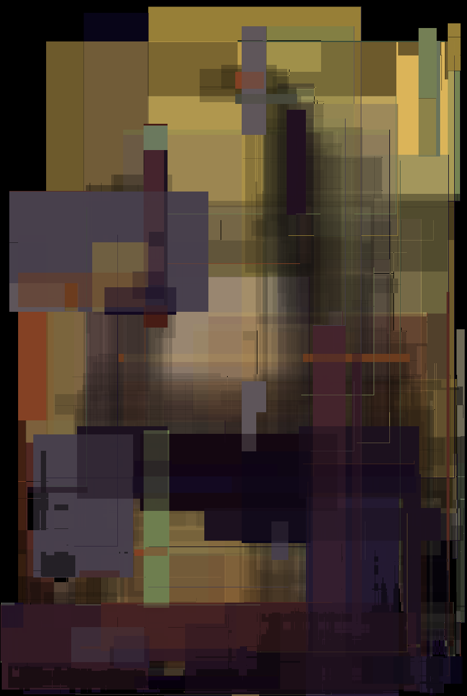

# Approximating Images with Rectangles using Simulated Annealing



A tool to approximate images with rectangles made for semestral project on BI-ZUM at FIT CTU.

## Usage

### Requirments

* clang>=10
* make

### Build

To generate cli tool or debug version run:

```sh
make cli.out
make debug_cli.out
```

Generate report with:
```sh
make report.pdf
```

Running following command will generate all of the above.
```sh
make
```

Bash script `generate.sh` generates approx/ folder that is partially used in report.

### CLI

Refer to `./cli.out --help` for assistance.

Examples:

Approximate `data/smile.jpg` using 100 rectangles over 10'000 iterations
```sh
./cli.out -i 10000 -r 100 -f data/smile.jpg
```
Approximate `data/smile.jpg` using 100 rectangles over 10'000 iterations with seed 999, save intermidiate result every 1000 iterations and save final image into `out.png`.
```sh
./cli.out -i 10000 --rect 100 -s 999 -f data/smile.jpg -o out.png --cooldown 1000
```

## TODO

- [x] Rewrite mutation schema
- [x] Add seeding
- [x] Add better default names
- [x] Rewrite RGBA to RGB
- [x] Add multithreading
- [~] Add color sampling
    - [ ] KMeans
    - [x] Random
- [~] Rewrite saving cooldown
    - [x] period saver
    - [ ] sigterm catcher
